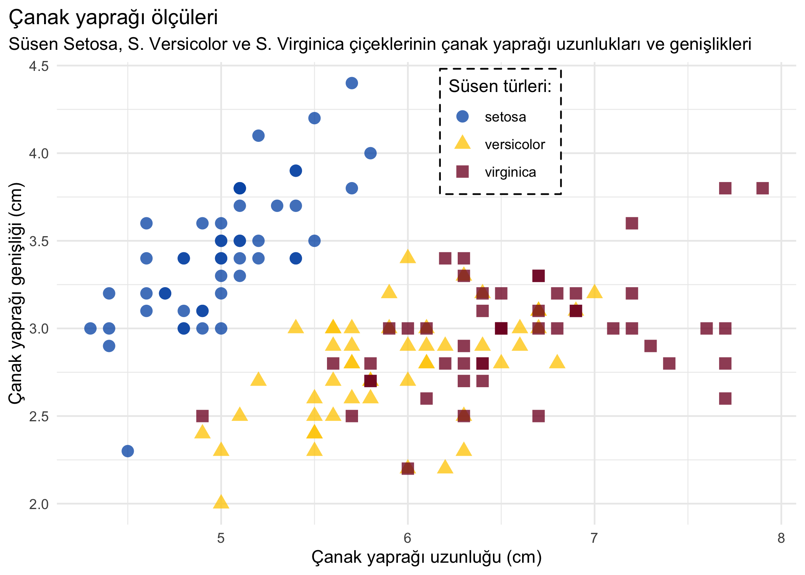

<!-- README.md is generated from README.Rmd. Please edit that file -->

# veriler

<!-- badges: start -->
<!-- badges: end -->

[R for Data Science](https://r4ds.had.co.nz/) kitabında kullanılan
verilerin Türkçe çevirilerini içerir.

## Yükleme

Paketi indirmek için:

``` r
# install.packages("remotes")
remotes::install_github("botan/veriler")
```

## Çeviriler

| İsim            | Başlık                                                                         | Paket        | Veri         |
|:----------------|:-------------------------------------------------------------------------------|:-------------|:-------------|
| bebek\_isimleri | Bebek isimleri                                                                 | babynames    | babynames    |
| old\_faithful   | Old Faithful gayzer verisi                                                     | datasets     | faithful     |
| süsen           | Edgar Anderson’ın Süsen (Iris) çiçeği türleri verileri                         | datasets     | iris         |
| mt\_arabalar    | Motor Trend’in Araba Yol Testleri                                              | datasets     | mtcars       |
| anket           | General Social Survey (GSS) araştırmasından kategorik değişken örnekleri       | forcats      | gss\_cat     |
| yaygın          | Yaygın taşıt modelleri                                                         | fueleconomy  | common       |
| taşıtlar        | Taşıtların yakıt ekonomileri                                                   | fueleconomy  | vehicles     |
| gapminder\_tr   | Gapminder verileri                                                             | gapminder    | gapminder    |
| elmaslar        | 50 bin adetten fazla yuvarlak kesim elmasın fiyatları                          | ggplot2      | diamonds     |
| miller          | 38 popüler otomobil modeli için 1999’dan 2008’e kadar yakıt ekonomisi verileri | ggplot2      | mpg          |
| başkanlık       | Eisenhower’dan Obama’ya 11 başkanın dönemleri                                  | ggplot2      | presidential |
| savunma         | Savunma istatistikleri tablosu                                                 | Lahman       | Fielding     |
| koçlar          | Takım koçları tablosu                                                          | Lahman       | Managers     |
| kişiler         | Kişiler tablosu                                                                | Lahman       | People       |
| atış            | Atış istatistikleri tablosu                                                    | Lahman       | Pitching     |
| maaşlar         | Maaşlar tablosu                                                                | Lahman       | Salaries     |
| atmosfer        | Atmosferik veriler                                                             | nasaweather  | atmos        |
| havayolları     | Havayolu adları                                                                | nycflights13 | airlines     |
| havalimanları   | Havalimanları kılavuzu                                                         | nycflights13 | airports     |
| uçuşlar         | Uçuşlar verisi                                                                 | nycflights13 | flights      |
| uçaklar         | Uçak kılavuz verileri                                                          | nycflights13 | planes       |
| hava\_durumu    | Saatlik hava durumu verisi                                                     | nycflights13 | weather      |
| tablo1          | Dünya Sağlık Örgütü tüberküloz kayıtları (ilk varyant)                         | tidyr        | table1       |
| tablo2          | Dünya Sağlık Örgütü tüberküloz kayıtları (ikinci varyant)                      | tidyr        | table2       |
| tablo3          | Dünya Sağlık Örgütü tüberküloz kayıtları (üçüncü varyant)                      | tidyr        | table3       |
| tablo4a         | Dünya Sağlık Örgütü tüberküloz kayıtları (dördüncü varyant, a)                 | tidyr        | table4a      |
| tablo4b         | Dünya Sağlık Örgütü tüberküloz kayıtları (dördüncü varyant, b)                 | tidyr        | table4b      |
| tablo5          | Dünya Sağlık Örgütü tüberküloz kayıtları (beşinci varyant)                     | tidyr        | table5       |
| dsö             | Dünya Sağlık Örgütü tüberküloz verileri                                        | tidyr        | who          |

## Örnek

Basit bir örnek:

``` r
library(tidyverse)
library(veriler)

glimpse(süsen)
#> Rows: 150
#> Columns: 5
#> $ çanak_uzunluğu  <dbl> 5.1, 4.9, 4.7, 4.6, 5.0, 5.4, 4.6, 5.0, 4.4, 4.9, 5.4,…
#> $ çanak_genişliği <dbl> 3.5, 3.0, 3.2, 3.1, 3.6, 3.9, 3.4, 3.4, 2.9, 3.1, 3.7,…
#> $ taç_uzunluğu    <dbl> 1.4, 1.4, 1.3, 1.5, 1.4, 1.7, 1.4, 1.5, 1.4, 1.5, 1.5,…
#> $ taç_genişliği   <dbl> 0.2, 0.2, 0.2, 0.2, 0.2, 0.4, 0.3, 0.2, 0.2, 0.1, 0.2,…
#> $ tür             <fct> setosa, setosa, setosa, setosa, setosa, setosa, setosa…

ggplot(süsen, aes(çanak_uzunluğu, çanak_genişliği, colour = tür, shape = tür)) +
  geom_point(size = 3.3, alpha = .77) +
  theme_minimal() +
  scale_color_manual(values = c("#0059b3", "#ffcc00", "#80002a")) +
  labs(
    title = "Çanak yaprağı ölçüleri",
    subtitle = "Süsen Setosa, S. Versicolor ve S. Virginica çiçeklerinin çanak yaprağı uzunlukları ve genişlikleri",
    x = "Çanak yaprağı uzunluğu (cm)",
    y = "Çanak yaprağı genişliği (cm)",
    color = "Süsen türleri:",
    shape = "Süsen türleri:"
  ) +
  theme(
    legend.position = c(.6, .85),
    legend.background  = element_rect(linetype = "dashed")
  )
```



## Dahili kodlar

`veriler` paketi içerisinde kullanılan tüm fonksiyonlar ve YAML
yapıları, aynı verilerin İspanyolca çevirilerini içeren
[`datos`](https://github.com/cienciadedatos/datos) paketinden
alınmıştır.
