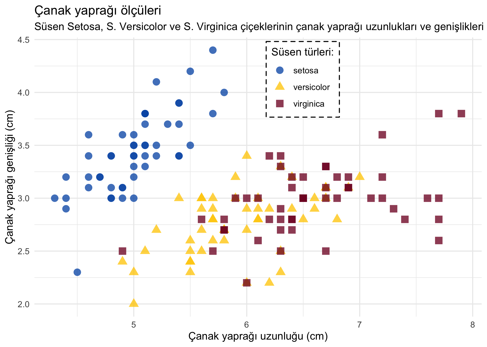

<!-- README.md is generated from README.Rmd. Please edit that file -->

# veriler

<!-- badges: start -->
<!-- badges: end -->

[R for Data Science](https://r4ds.had.co.nz/) kitabında kullanılan
verilerin Türkçe çevirilerini içerir.

## Yükleme

Paketi indirmek için:

``` r
# install.packages("remotes")
remotes::install_github("botan/veriler")
```

## Çeviriler

| İsim     | Başlık                                                                         | Paket    | Veri     |
|:---------|:-------------------------------------------------------------------------------|:---------|:---------|
| süsen    | Edgar Anderson’ın Süsen (Iris) çiçeği türleri verileri                         | datasets | iris     |
| elmaslar | 50 bin adetten fazla yuvarlak kesim elmasın fiyatları                          | ggplot2  | diamonds |
| miller   | 38 popüler otomobil modeli için 1999’dan 2008’e kadar yakıt ekonomisi verileri | ggplot2  | mpg      |

## Örnek

Basit bir örnek:

``` r
library(tidyverse)
library(veriler)

glimpse(süsen)
#> Rows: 150
#> Columns: 5
#> $ çanak_uzunluğu  <dbl> 5.1, 4.9, 4.7, 4.6, 5.0, 5.4, 4.6, 5.0, 4.4, 4.9, 5.4…
#> $ çanak_genişliği <dbl> 3.5, 3.0, 3.2, 3.1, 3.6, 3.9, 3.4, 3.4, 2.9, 3.1, 3.7…
#> $ taç_uzunluğu    <dbl> 1.4, 1.4, 1.3, 1.5, 1.4, 1.7, 1.4, 1.5, 1.4, 1.5, 1.5…
#> $ taç_genişliği   <dbl> 0.2, 0.2, 0.2, 0.2, 0.2, 0.4, 0.3, 0.2, 0.2, 0.1, 0.2…
#> $ tür             <fct> setosa, setosa, setosa, setosa, setosa, setosa, setos…

ggplot(süsen, aes(çanak_uzunluğu, çanak_genişliği, colour = tür, shape = tür)) +
  geom_point(size = 3.3, alpha = .77) +
  theme_minimal() +
  scale_color_manual(values = c("#0059b3","#ffcc00","#80002a")) +
  labs(
    title = "Çanak yaprağı ölçüleri",
    subtitle = "Süsen Setosa, S. Versicolor ve S. Virginica çiçeklerinin çanak yaprağı uzunlukları ve genişlikleri",
    x = "Çanak yaprağı uzunluğu (cm)",
    y = "Çanak yaprağı genişliği (cm)",
    color = "Süsen türleri:",
    shape = "Süsen türleri:"
  ) +
  theme(
    legend.position = c(.6, .85),
    legend.background  = element_rect(linetype = "dashed"),
    plot.title.position = "plot"
  )
```



## Dahili kodlar

`veriler` paketi içerisinde kullanılan tüm fonksiyonlar ve YAML
yapıları, aynı verilerin İspanyolca çevirilerini içeren
[`datos`](https://github.com/cienciadedatos/datos) paketinden
alınmıştır.
